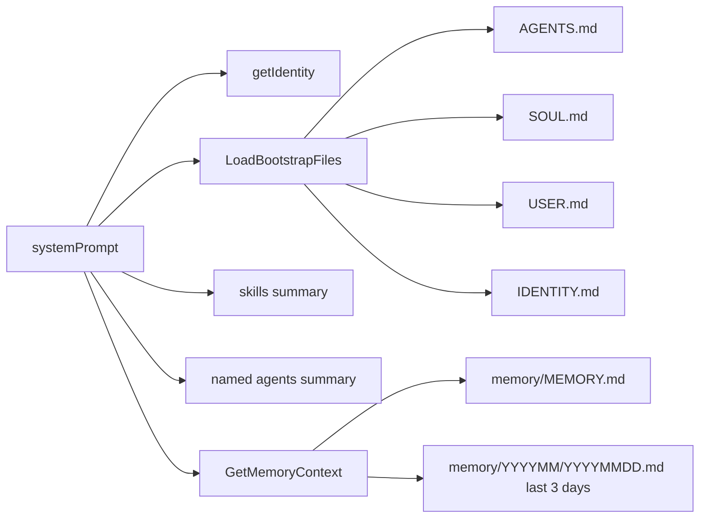
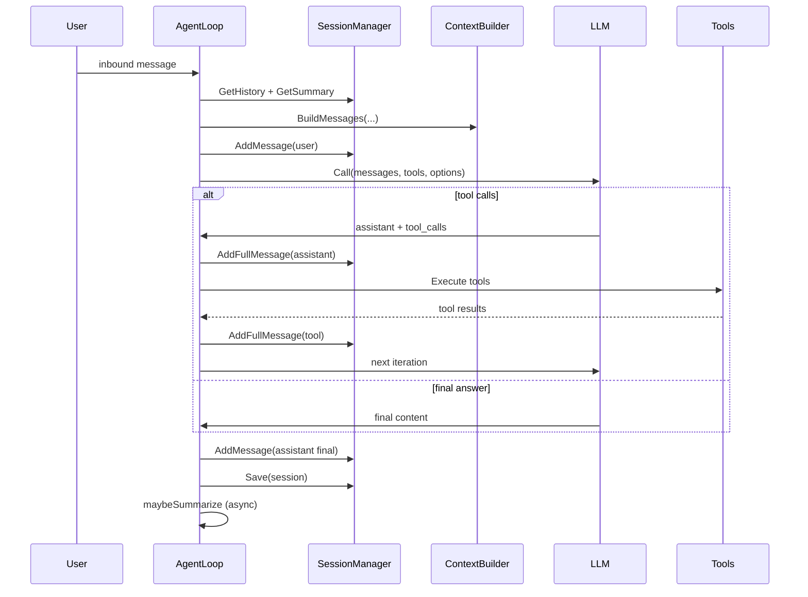

# Session Context, Compact/Consolidation a Memory v PicoClaw

Dokument popisuje presne runtime chovani aktualni implementace.

## Update 2026-02-21 (inject/subagent completion)

- `inject` payload je neutralni:
  - `<inject_message source=\"...\"> ... </inject_message>`
  - runtime nepridava automaticke "urgent/priority/respond now" instrukce.
- Active-run `inject` uz nedela preempt/cancel.
  - Zprava se prilepi do aktivniho kontextu a zpracuje v nasledujici LLM iteraci stejneho runu.
- Pri dokoncení subagenta (`system` completion):
  - notifikace se vzdy ulozi do history jako `system` zprava,
  - kdyz bezi aktivni run, completion se injectne do toho runu,
  - kdyz run nebezi, gateway okamzite spusti stejnou session pres LLM (bez cekani na dalsi user message).
- Subagent toolloop context window:
  - primarne bere `agents.defaults.context_window`,
  - fallback na odhad z `max_tokens` je jen pri nevyplnenem default context window.

## 1) Jak se sklada context pro hlavni LLM call

Vstupni flow je v `runAgentLoop(...)` v `pkg/agent/loop.go`.

Kroky:
1. `history := sessions.GetHistory(sessionKey)`
2. `summary := sessions.GetSummary(sessionKey)`
3. `messages := contextBuilder.BuildMessages(history, summary, currentUserMessage, channel, chatID)`

`BuildMessages(...)` v `pkg/agent/context.go` sklada `messages` presne takto:
1. `messages[0] = {role: "system", content: systemPrompt}`
2. `messages[1..N] = history`
3. `messages[last] = {role: "user", content: currentUserMessage}`

Definice `N`:
- `N = len(history)`
- `history` je kopie `session.Messages` vracena `GetHistory(sessionKey)`
- kdyz session neexistuje: `history = []`, tedy `N = 0`

Definice `GetSummary`:
- vraci `session.Summary` pro dany `sessionKey`
- kdyz session neexistuje: `""`

## 2) Co presne obsahuje `systemPrompt`

`systemPrompt` se sklada v `BuildSystemPrompt()` v `pkg/agent/context.go` v tomto poradi:
1. Core identity (`getIdentity()`)
2. Bootstrap soubory z workspace:
   - `AGENTS.md`
   - `SOUL.md`
   - `USER.md`
   - `IDENTITY.md`
3. Skills summary
4. Named agents summary
5. Memory context (`MemoryStore.GetMemoryContext()`)

Pak `BuildMessages(...)` jeste doplni:
- `## Current Session` (pokud je `channel` a `chatID`)
- `## Summary of Previous Conversation` (pokud `summary != ""`)

### Jak jsou `.md` soubory obalene
- cele je to jedna `system` message
- jednotlive bloky system promptu jsou spojene separatoren `\n\n---\n\n`
- bootstrap soubory jsou obalene jako:
  - `## AGENTS.md`
  - `## SOUL.md`
  - `## USER.md`
  - `## IDENTITY.md`
- memory je obalena jako:
  - `# Memory`
  - `## Long-term Memory`
  - `## Recent Daily Notes`

### Mermaid: slozeni `systemPrompt`


## 2.1 `getIdentity()` - presny vystup

`getIdentity()` vraci jeden string slozeny formatem `fmt.Sprintf(...)`.
Presna sablona (s runtime placeholdery) je:

```text
# picoclaw 🦞

You are picoclaw, a helpful AI assistant.

## Current Time
{NOW_FORMATTED}

## Runtime
{GOOS} {GOARCH}, Go {GOVERSION}

## Workspace
Your workspace is at: {ABS_WORKSPACE}
- Memory: {ABS_WORKSPACE}/memory/MEMORY.md
- Daily Notes: {ABS_WORKSPACE}/memory/YYYYMM/YYYYMMDD.md
- Skills: {ABS_WORKSPACE}/skills/{skill-name}/SKILL.md

{TOOLS_SECTION}

## Important Rules

1. **ALWAYS use tools** - When you need to perform an action (schedule reminders, send messages, execute commands, etc.), you MUST call the appropriate tool. Do NOT just say you'll do it or pretend to do it.

2. **Be helpful and accurate** - When using tools, briefly explain what you're doing.

3. **Memory** - When remembering something, write to {ABS_WORKSPACE}/memory/MEMORY.md
```

Kde:
- `{NOW_FORMATTED}` = `time.Now().Format("2006-01-02 15:04 (Monday)")`
- `{TOOLS_SECTION}` je dynamicky text z registrovanych tools (`GetSummaries()`), kazdy tool je radek `- \`name\` - description`

## 2.2 Presny "source map" po znacich (co je ze stringu, co ze souboru)

System prompt je konkatenace bloku oddelenych `\n\n---\n\n`.
Kazdy blok je bud:
- `CODE_LITERAL`: pevny text ze string literalu v Go kodu
- `RUNTIME_VALUE`: runtime hodnota z programu
- `FILE_CONTENT`: obsah souboru bez dalsiho parseru/normalizace

| Poradi | Blok | Typ zdroje | Transformace |
|---|---|---|---|
| 1 | `getIdentity` | `CODE_LITERAL + RUNTIME_VALUE + TOOLS_LIST_RUNTIME` | `fmt.Sprintf`; beze zmeny obsahu tools summary |
| 2 | `AGENTS.md` wrapper + obsah | wrapper=`CODE_LITERAL`, obsah=`FILE_CONTENT` | wrapper `## AGENTS.md\n\n` + raw file bytes jako string |
| 3 | `SOUL.md` wrapper + obsah | wrapper=`CODE_LITERAL`, obsah=`FILE_CONTENT` | stejny princip |
| 4 | `USER.md` wrapper + obsah | wrapper=`CODE_LITERAL`, obsah=`FILE_CONTENT` | stejny princip |
| 5 | `IDENTITY.md` wrapper + obsah | wrapper=`CODE_LITERAL`, obsah=`FILE_CONTENT` | stejny princip |
| 6 | skills summary blok | `CODE_LITERAL + RUNTIME_VALUE` | text summary vytvoreny skills loaderem |
| 7 | named agents summary blok | `CODE_LITERAL + RUNTIME_VALUE` | runtime scan `workspace/agents/*` |
| 8 | memory blok | wrapper=`CODE_LITERAL`, obsah=`FILE_CONTENT` | `MEMORY.md` + daily notes spojene `\n\n---\n\n` |
| 9 | current session suffix | `CODE_LITERAL + RUNTIME_VALUE` | pridano jen kdyz `channel` a `chatID` nejsou prazdne |
| 10 | previous conversation summary suffix | `CODE_LITERAL + RUNTIME_VALUE` | pridano jen kdyz `summary != ""` |

## 2.3 Presny vznik obsahu `summary` (co v nem je)

`GetSummary()` jen vraci ulozeny string. Obsah tohoto stringu vznika v `summarizeSession(...)` takto:

1. Vezme `history` bez poslednich 4 zprav.
2. Odfiltruje vse mimo role `user/assistant`.
3. Odfiltruje oversized zpravy (`len(content)/4 > context_window/2`).
4. Vytvori prompt pro sumarizaci:
   - pevny prefix:
     - `Provide a concise summary of this conversation segment, preserving core context and key points.`
   - pokud existuje predchozi summary, prida:
     - `Existing context: {existingSummary}`
   - pak prida:
     - `CONVERSATION:`
     - pro kazdou zpravu radek `{role}: {content}`
5. LLM vrati text summary (`max_tokens=1024`, `temperature=0.3`).
6. Tenhle text se ulozi jako `session.summary`.

Takze obsah `summary` je cisty LLM-vygenerovany shrnujici text nad predchozi konverzaci (bez tool role), ne metadata objekt.

## 3) Jak probiha zpracovani jedne user zpravy

V `runAgentLoop(...)`:
1. postavi `messages` (sekce 1)
2. ulozi user zpravu do session:
   - `sessions.AddMessage(sessionKey, "user", opts.UserMessage)`
3. spusti `runLLMIteration(...)`

V `runLLMIteration(...)`:
1. LLM call s:
   - `messages`
   - `tools`
   - `model`
   - `LLM options`: `max_tokens`, `temperature`
2. pokud LLM vrati `tool_calls`:
   - ulozi assistant message s tool calls: `AddFullMessage`
   - provede tool calls
   - kazdy tool vysledek ulozi jako `role=tool`: `AddFullMessage`
   - pokracuje dalsi iterace
3. pokud LLM vrati odpoved bez `tool_calls`:
   - to je finalni odpoved

Po skonceni loopu:
1. `sessions.AddMessage(sessionKey, "assistant", finalContent)`
2. `sessions.Save(sessionKey)`
3. `maybeSummarize(sessionKey)` (asynchronne, pokud je summary zapnute pro ten flow)

### Mermaid: end-to-end pipeline


## 3.1 Realny tvar `messages[]` v case (snapshoty)

Nize je presna struktura, kterou LLM dostane. Texty jsou zkracene na schematicky priklad, poradi odpovida kodu.

### Snapshot A: uplne prvni zprava v nove session
`history=[]`, `summary=""`

```text
messages[0] role=system
  content=
    {systemPrompt:
      getIdentity + bootstrap files + skills + named agents + memory
      + optional "Current Session"
      (bez "Summary of Previous Conversation")
    }

messages[1] role=user
  content="{aktualni user zprava}"
```

### Snapshot B: dalsi user zprava, session uz ma historii, ale jeste bez consolidation
`history` obsahuje dosavadni user/assistant/tool flow, `summary=""`

```text
messages[0] role=system
  content={systemPrompt bez summary sekce}

messages[1..N] role=... (kopie session.Messages)
  napr:
    [1] user: ...
    [2] assistant: ... (+tool_calls)
    [3] tool: ...
    [4] assistant: ...
    ...

messages[N+1] role=user
  content="{nova user zprava}"
```

### Snapshot C: po consolidation (summary existuje, historie je zkracena)
Po `SetSummary + TruncateHistory(4)`:

```text
messages[0] role=system
  content=
    {systemPrompt}
    + "\n\n## Summary of Previous Conversation\n\n"
    + "{session.summary text}"

messages[1..4] role=... (jen posledni 4 zpravy session)
messages[5] role=user
  content="{nova user zprava}"
```

Tohle je duvod, proc se "starsi kontext" po consolidation presune z explicitni historie do `summary` sekce uvnitr system promptu.

## 4) Kdy presne dochazi ke consolidation (hlavni agent)

Consolidation = sumarizace session + zkraceni historie.

Spousti ji `maybeSummarize(sessionKey)` v `pkg/agent/loop.go`.

Trigger:
- `len(history) > history_message_threshold`
- nebo `estimateTokens(history) > context_window * memory_threshold`

`estimateTokens(history)`:
- soucet `utf8.RuneCountInString(message.Content) / 3` pres vsechny zpravy

Prubeh `summarizeSession(sessionKey)`:
1. kdyz `len(history) <= 4` -> return (nic se nedela)
2. `toSummarize = history[:len(history)-4]`
3. filtrace:
   - jen role `user` a `assistant`
   - oversized guard: message se vynecha, kdyz `len(content)/4 > context_window/2`
4. sumarizace:
   - pokud `len(validMessages) > 10`: 2 batch summary + merge
   - jinak: 1 batch summary
5. pokud vznikne `finalSummary`:
   - `SetSummary(sessionKey, finalSummary)`
   - `TruncateHistory(sessionKey, 4)`
   - `Save(sessionKey)`

Hardcoded konstanty consolidation:
- keep history after consolidation: `4`
- summary call `max_tokens`: `1024`
- summary call `temperature`: `0.3`
- split boundary: `len(validMessages) > 10`

### Mermaid: consolidation trigger a akce
```mermaid
flowchart TD
  A[after Save(session)] --> B[maybeSummarize]
  B --> C{len(history) > history_message_threshold<br/>OR<br/>estimateTokens > context_window*memory_threshold}
  C -- no --> Z[no summary]
  C -- yes --> D[summarizeSession async]
  D --> E[build finalSummary]
  E --> F[SetSummary]
  F --> G[TruncateHistory keepLast=4]
  G --> H[Save(session)]
```

## 5) Kdy presne dochazi ke compact u subagenta

Subagent nepouziva hlavni session consolidation (`maybeSummarize`).

Subagent pouziva `RunToolLoop(...)` v `pkg/tools/toolloop.go` a pred kazdym LLM callem dela compact trim:
1. `trimMessagesByCount(messages, HistoryMessageThreshold)` pokud threshold > 0
2. `trimMessages(messages, ContextLimit)` pokud limit > 0

`ContextLimit` je odvozen v `pkg/tools/subagent.go`:
- `ContextLimit = max_tokens * 20`

Trim pravidla:
- vzdy zachova `messages[0]` (system) a `messages[1]` (puvodni user task)
- odstraňuje nejstarsi cele roundy (`assistant` + navazujici `tool`), aby se nerozbily vazby `tool_call_id`

Hardcoded konstanta subagent compact:
- multiplikator `20` pro prepocet `max_tokens -> ContextLimit`

## 6) Memory: co je automaticke a co dela agent sam

## Automaticke nacitani memory do contextu
`GetMemoryContext()` (`pkg/agent/memory.go`) sklada:
1. long-term:
   - cely obsah `workspace/memory/MEMORY.md`
2. daily notes:
   - `GetRecentDailyNotes(3)` = posledni 3 dny
   - spoji je separatoren `\n\n---\n\n`

Poznamka:
- pocet dni `3` je hardcoded v `GetMemoryContext()`
- v config schema neni parametr pro zmenu poctu dni

## Zapis do memory
Zapis neni centralni automaticka vrstva.
Agent zapisuje pres file tools (`write_file`, `append_file`) podle prompt instrukci.

Named subagent (`name` zadan):
- nacita:
  - `workspace/agents/<name>/AGENTS.md`
  - `workspace/agents/<name>/memory/MEMORY.md`
- dostane explicitni prompt instrukci zapisovat do:
  - `workspace/agents/<name>/memory/MEMORY.md`
  - `workspace/agents/<name>/memory/YYYYMM/YYYYMMDD.md`

Write-scope omezeni:
- named agent memory write je povolena jen do kanonicke cesty `.../agents/<name>/memory`
- mirrored `.picoclaw/workspace/agents/.../memory` cesty jsou blokovane

## 6.1 Jak memory meni context mezi zacatkem a prubehem konverzace

- Memory blok (`MEMORY.md` + posledni 3 daily notes) je nacitan pri kazdem sestaveni system promptu.
- To znamena:
  - pokud agent nebo uzivatel mezitim zmeni tyto soubory, zmena se projevi v dalsim LLM callu.
  - neni tam cache "jednou na start"; je to znovu cteno pri stavbe promptu.
- Samotna session historie (`GetHistory`) je oddelena od memory souboru:
  - history je per-session konverzace
  - memory je globalni knowledge vrstva z files

## 7) Presny vliv konfigurace

Tyto hodnoty:
```json
"max_tokens": 8192,
"max_iterations": 20,
"context_window": 131072,
"temperature": 0.7,
"max_tool_iterations": 20,
"max_concurrent_subagents": 2,
"memory_threshold": 0.8,
"history_message_threshold": 100
```
v `agents.defaults` ovlivnuji runtime takto:

| Parametr | Presny vliv |
|---|---|
| `max_tokens` | Hlavni agent: `LLMOptions.max_tokens` v beznem LLM callu. |
| `max_iterations` | Hlavni agent: max pocet iteraci `runLLMIteration`. |
| `context_window` | Hlavni agent: summary trigger (`context_window * memory_threshold`) a oversized guard (`context_window/2`). |
| `temperature` | Hlavni agent: `LLMOptions.temperature` v beznem LLM callu. |
| `max_tool_iterations` | Hlavni agent: limit iteraci, kde LLM vraci tool calls. |
| `max_concurrent_subagents` | Vychozi limit soubezne bezicich subagentu (spawn path). |
| `memory_threshold` | Hlavni agent: multiplier pro token trigger consolidation. |
| `history_message_threshold` | Hlavni agent: message-count trigger consolidation. |

Doplnujici presnost:
- subagent ma vlastni config vetve `agents.subagents.*` a `agents.<name>.*`
- pro subagent je priorita: `agents.<name>.*` > `agents.subagents.*`
- `max_concurrent_subagents` ma prioritu: `agents.<name>.max_concurrent_subagents` > `agents.subagents.max_concurrent_subagents` > `agents.defaults.max_concurrent_subagents`

## 8) Rozdily: hlavni agent vs subagent

| Tema | Hlavni agent | Subagent |
|---|---|---|
| Consolidation summary | Ano (`maybeSummarize`) | Ne |
| Kdy se zkracuje context | Po odpovedi (async summary path) | Pred kazdym LLM callem (trim v loopu) |
| Trigger `memory_threshold` | Ano | Ne |
| Trigger `history_message_threshold` | Ano (summary trigger) | Ano (trim-by-count) |
| `context_window` | Ano (summary math + guard) | Ne (subagent pouziva `ContextLimit=max_tokens*20`) |
| Session JSON `summary` | Ano | Nepouziva stejnou vrstvu |
| Memory source | `workspace/memory/...` | `workspace/agents/<name>/memory/...` jen pro named |

## 9) Kde je to v kodu

- `pkg/agent/loop.go` (hlavni loop, summary trigger, summarizeSession)
- `pkg/agent/context.go` (BuildSystemPrompt, BuildMessages)
- `pkg/agent/memory.go` (GetMemoryContext, GetRecentDailyNotes)
- `pkg/session/manager.go` (GetHistory, GetSummary, Save, TruncateHistory)
- `pkg/tools/toolloop.go` (subagent trim)
- `pkg/tools/subagent.go` (subagent config resolution, ContextLimit)
- `pkg/config/config.go`, `config/config.example.json` (schema)
